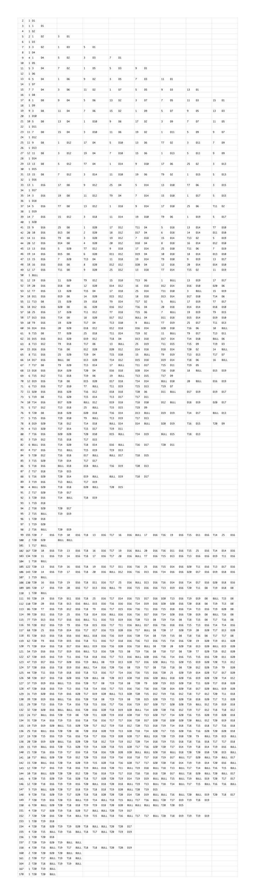

# Darts

This is a small collection of Ruby classes for computing best dart finishes (in the sense of minimum number of throws). Calculations are done based on standard rules of darts (501, double out).

## Examples of Usage

You can load the present code within this project folder via

```ruby
require_relative 'lib/darts'
```

If you want to know how many throws are necessary for scoring 349 and how many different best score orders exist, use the following code

```ruby
best_orders = Darts::ComputeBestScoreOrders.new(349).call

# minimal number of throws necessary to score 349
best_orders.number_of_throws # => 7

# number of different best score orders for 349
best_orders.count # => 1240
```

Or compute throws of a random score order for a nine dart finish

```ruby
best_orders = Darts::ComputeBestScoreOrders.new(501).call

# a random nine dart finish
best_orders.throws.sample # => "T20 T20 T20 T20 T20 T20 T19 BULL D17"
```

Check also tests for more examples.

The following table gives an overview over all scores which can be thrown with no more than three throws (all three dart finishes). The second column specifies the number of different minimal throws and subsequent columns show examples of throws.


